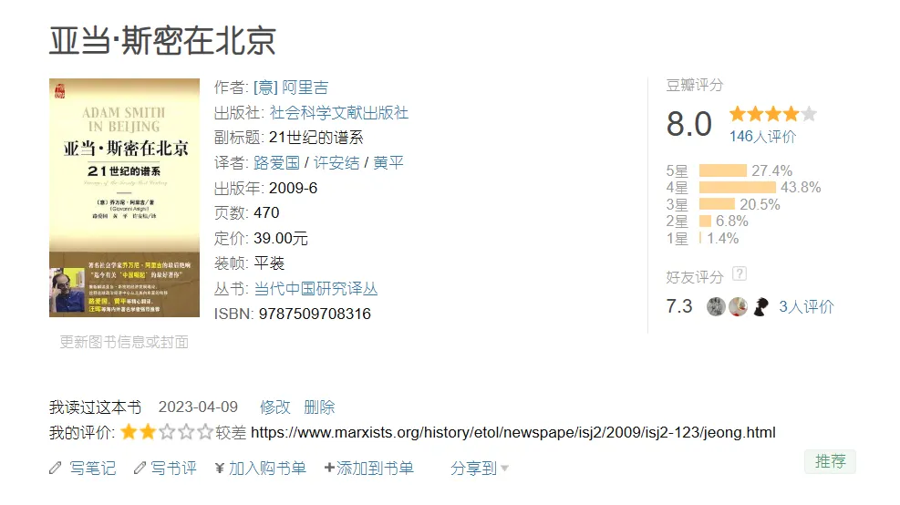
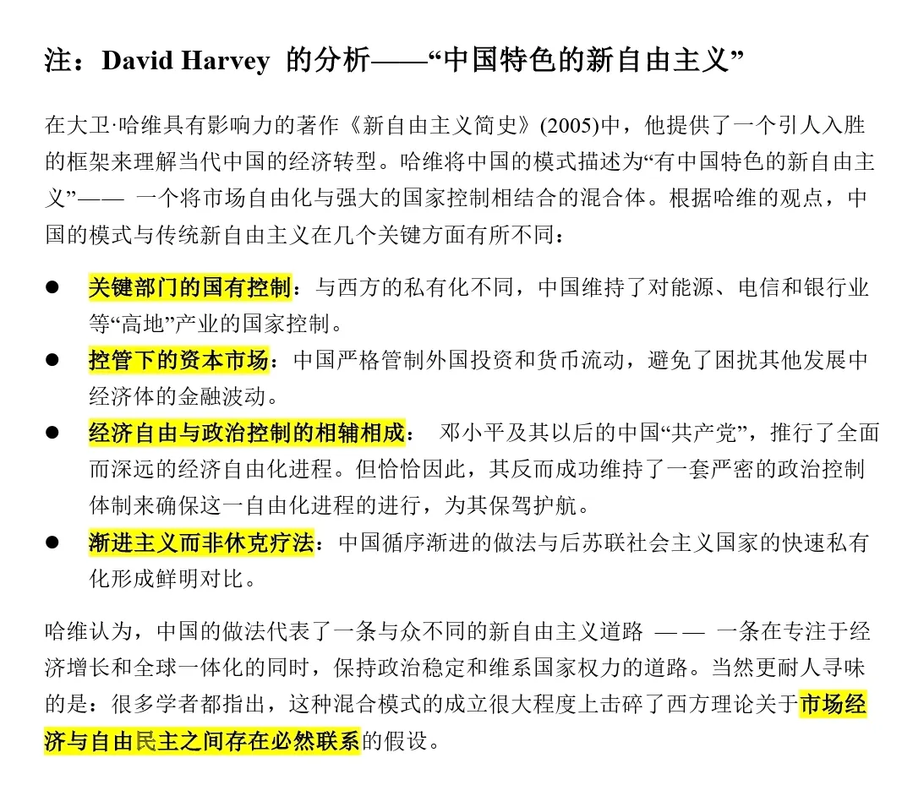

**丁声镇 (정성진，Seongjin Jeong)**

选自《国际社会主义》（International Socialism）期刊 第2辑 第123期，2009年夏季刊。 由 Owen Miller 翻译为英文。

*
该书中文译本的豆瓣页面，我在2023年4月9日的书评链接即为丁声镇原文的英译文转载页面
*

> **英译原页面的导引：**
>
> 以下书评由韩国庆尚国立大学经济学教授丁声镇撰写。丁教授著有多本韩文著作出版，如《马克思与韩国经济》以及《马克思与托洛茨基》。他也是英文书籍《从马克思主义视角看全球经济中的韩国》（Marxist Perspectives on South Korea in the Global Economy, Ashgate, 2007）的共同编辑，双语期刊《马克思主义21》（Marxism21）的编辑，并将亚历克斯·卡利尼科斯（Alex Callinicos）的《反资本主义宣言》（An Anticapitalist Manifesto）和《卡尔·马克思的革命思想》（The Revolutionary Ideas of Karl Marx）翻译成韩文。
>
> 在韩国，乔万尼·阿里吉的著作在一部分知识左派中颇受欢迎，他们全心接纳了他对马克思主义的改造，并欢迎他对以中国为中心的可能未来所作的积极评价。因此，丁教授对阿里吉“非资本主义市场社会”概念的论战式抨击，应当在韩国左翼政治的脉络下理解。
---
### 正文
随着去年奥运会期间北京成为世界焦点，乔万尼·阿里吉的新书《亚当·斯密在北京》变得更加受到了全球进步学者的广泛关注。[^1] 在韩国，阿里吉也与伊曼努尔·沃勒斯坦（Immanuel Wallerstein）及已故的安德烈·贡德·弗兰克（Andre Gunder Frank）齐名，被视为世界体系理论的主要理论家之一。来自韩国PD派[^2]的许多知识分子接受了“历史资本主义”这一论点，该论点构成了所谓“广义马克思主义”（“generalised Marxism”）的核心，它源自阿里吉最著名的著作《漫长的20世纪》（The Long Twentieth Century, 1994）（——译注：有繁体中文译本：《漫長的二十世紀－金錢、權力與我們社會的根源》，1999）。

韩国和世界各地的许多学者都热切期待阿里吉13年来首部新书的出版。但这本书就像仅仅只在传说中的宴会，空有其名，真的一看却又无食物可吃。甚至可以这么说：从醒目的书名（阿里吉本人也承认，这是模仿马里奥·特隆蒂1971年的著作《马克思在底特律》）开始，一切都存在问题。

在《亚当·斯密在北京》中，阿里吉宣称当今中国社会是一个“非资本主义市场经济”社会。因此，对他而言，现代中国并非马克思《资本论》中描绘的资本主义世界，而是亚当·斯密《国富论》中描绘的市场经济世界。根据阿里吉的说法，与以剥削、不平等、扩张主义和“剥夺性的积累”（Accumulation by dispossession——译注：“剥夺性积累”这一概念由David Harvey提出，用于描述资本主义通过剥夺他人财产、资源和权利等方式来实现资本积累的过程，它涵盖了诸如圈地运动、殖民掠夺、私有化等行为）为特征的资本主义相反，某种非资本主义的市场经济则基于互惠、平等和“占有性的积累”（accumulation by possession — — 译注：强调原本所有而非剥削）的原则。对他来说，市场经济是比资本主义更可取的社会体系，我们世界的问题源于资本主义而非市场经济。

阿里吉坚称，在当今世界，美国是主要的资本主义国家，而中国是主要的市场经济体。基于此前提，他进而论证，在21世纪，尤其是在伊拉克战争之后，美国资本主义的全球霸权正濒临其“终结性危机”时刻（“terminal crisis”），而中国市场经济在此时代的迅速崛起成为世界经济中心，则具有历史进步性。他甚至更进一步，将中国和其他“非资本主义的市场经济”体描绘成进步力量可以寄望的“现实存在的替代方案”。

《亚当·斯密在北京》全书所依赖的核心假设是市场经济与资本主义之间的区分。这个区分并非阿里吉首创，而是由社会史学家费尔南·布罗代尔（Fernand Braudel）在其著作《十五到十八世纪的文明与资本主义》（Civilisation matérielle et capitalisme, XVe-XVIIIe siècle）中提出的。但在马克思的政治经济学批判中，其实并不能找到这种区分。当然，斯大林和另外的一些马克思主义者，如厄内斯特·曼德尔（Ernest Mandel），亦曾断言在资本主义商品体系建立之前，确实存在一个对应于布罗代尔和阿里吉所谓“非资本主义市场经济”的“简单商品生产”体系。但马克思本人从未使用过“简单商品生产”这个概念[^3] 。马克思提出，资本主义是以劳动力商品化为基础的，普遍商品生产（市场经济）的历史体系。他从未暗示过“市场经济”有作为一个独立于资本主义体系的体系而存在的可能性。

在实际的历史进程中，当市场经济得到普遍发展并作为一种独立的社会制度确立起来时，马克思就恰恰已经将其称为资本主义。历史上没有“市场经济”作为一种独立的、自成一体的社会制度而存在的例子。事实上，“全球化”这一21世纪资本主义的核心特征，恰恰不过是市场经济向全球范围的扩展，换言之，是资本主义的商品化、市场化和竞争主义逻辑的真正全面实现。

当人们像布罗代尔和阿里吉那样将市场经济与资本主义区分开来时，实际上完全使得让人无法对资本主义制度本身进行批判，尽管这可能与他们的本意大相径庭。而且，阿里吉将中国当下的资本主义理想化地描述成一种“非资本主义的市场经济”，最终也只是对其剥削、压迫的现实以及其内在矛盾的视而不见。

在我看来，马克思在《资本论》中正式提出的资本主义 “运动规律”，在20世纪80年代以来的中国经济发展中，比历史上任何其他国家都发挥了更明显的作用。这些 “运动规律 ”在过去三十年中以其最典型的形式出现在中国：资本有机构成的上升趋势、由此导致的 “产业后备军 ”的累积性增加（即马克思所说的 “资本主义积累的一般规律”）以及利润率的下降趋势[^4] 。与其说中国是其统治者宣称的 “中国特色社会主义”社会，David Harvey 的 “有中国特色的新自由主义 ”一词显然更适合描述现在的中国。

不幸的是，就在阿里吉认定中国提供了一种“非资本主义市场经济”以及一种能从陷入困境的美国经济中“脱钩”的可能性，并将其作为人类在21世纪的替代方案后不久，中国自身的经济就突然硬着陆，并与不断加深的全球经济危机之间“重新挂钩”（实则并非重新）。事实证明，中国经济非但没有为世界经济提供替代性的新增长引擎，反而透过加剧全球范围内的生产过剩和积累过剩，成为了当前全球经济危机的新一个中心。随着中国密集型积累所导致的国内矛盾和全球失衡加剧，以及全球生态危机的恶化，中国极有可能成为引发更大规模世界经济总危机的关键导-索。

如果我们想把中国看作 21 世纪一种可能的替代方案，那就不能把中国视为其他国家可以效仿的 “非资本主义 ”体系。相反，它应该是一个类似于 20 世纪初俄罗斯一样的国家：全球资本主义体系的 “最薄弱环节”，在这一国度，发展不平衡和发展不协调的矛盾达到了最激烈和最尖锐的程度 —— 换句话说，中国是全世界最有可能再次爆发反资本主义工人革命的国家。

在去年北京奥运会期间出现的商业主义、沙文主义和儒家思想的全面复兴背后，我们看到的不是亚当·斯密所梦想的“勤劳致富经济”，而是一个以超水平剥削、不平等、竞争和积累、剥夺和帝国主义逻辑为特征的血淋淋的资本主义现实。这是一个仍然被马克思幽灵所困扰的社会。为了分析这种中国资本主义现实并考虑替代方案，我们仍然需要马克思《资本论》提供的框架，而不是斯密的《国富论》。

PD派的知识分子可能认为阿里吉是他们所采纳了的“广义马克思主义”（“generalised Marxism”）立场中的核心理论家之一，但他的思想与我们马克思主义悠久的传统之间根本毫无共同之处。如同《漫长的二十世纪》一样，《亚当·斯密在北京》同样完全缺乏马克思关于阶级斗争和价值规律等问题探究的问题意识。

阿里吉的整本书都致力于批判罗伯特·布伦纳（Robert Brenner）的作品：《全球动荡的经济学》（The Economics of Global Turbulence, 2005，这本书可以被视为对现代资本主义宏观动态进行分析的最新成果）。然而，尽管阿里吉对布伦纳的许多观点都提出了异议，在学术水平上，这两本书却根本无法相提并论。《全球动荡的经济学》基于一套独立而完整构建起来的马克思主义危机理论，来对第一手资料进行政治分析，而《亚当·斯密在北京》则只是简单地拼凑和粘贴了各种解读错误的二手资料而已。如果阿里吉真的有能力看清现实，标题显然会是《卡尔·马克思在北京》。

---
### 注释

[^1]: 我非常感谢欧文·米勒（Owen Miller）同志对我文章的出色翻译，该文首次发表于《烛光抵抗》（Candlelight Resistance）杂志2008年8月号。

[^2]: PD 派指的是“民众民主”派（People’s Democracy） — — 这是源于20世纪80年代韩国工人和学生斗争运动的、主导韩国斯大林主义左翼的两大主要派别之一（另一个是NL派）。PD派认为韩国社会的特征是“国家垄断资本”，而他们的对手NL派（民族解放）派则视韩国为受美日资本支配的半殖民地社会。NL派大体上仍坚持某种形式的左翼民族主义政治，有的甚至会支持北朝鲜政权（主体思想派）；而PD派在20世纪90年代和（21世纪）零零年代分裂为许多不同分支，这些分支都日益受到后马克思主义和后现代主义思想的影响。

[^3]: 关于文献学考据，请参阅 Christopher Arthur, [《“简单商品生产”的神话》（Myth of ‘Simple Commodity Production’）](http://marxmyths.org/chris-arthur/article2.htm), 收录于《马克思的神话与传奇》（Marx Myths and Legends）, 2005年。

[^4]: 请参阅 Chris Harman, [《误读与误解》（Misreadings and Misconceptions）](https://www.isj.org.uk/?id=462), 《国际社会主义》第119期；以及 Lee Jeong Koo, 《关于1990年代以来中国国家资本主义发展的研究》（A Study on the Development of State Capitalism in China since 1990s）, 博士论文, 庆尚国立大学, 2009年（韩文）。
