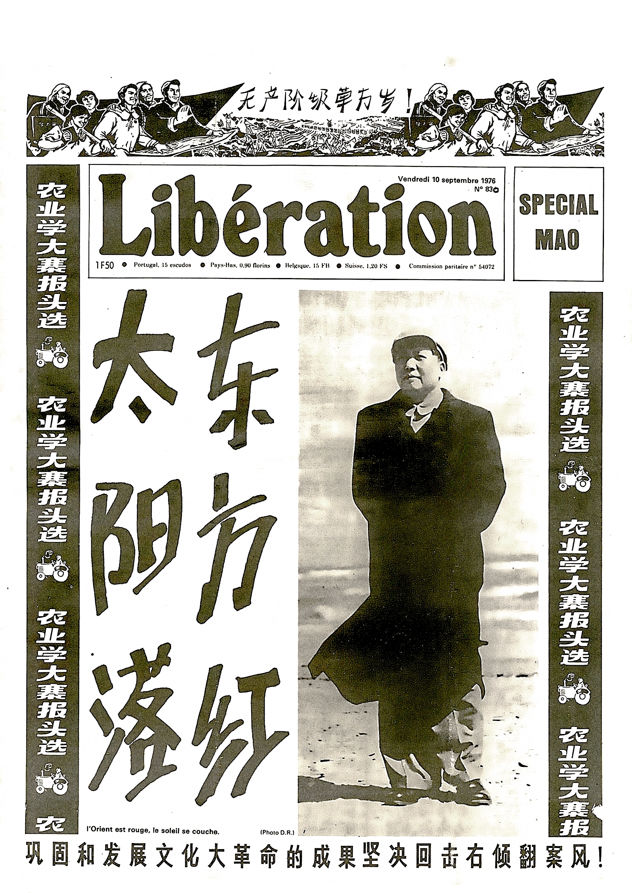
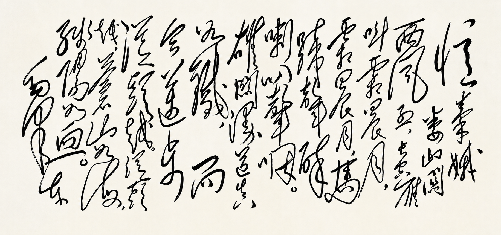
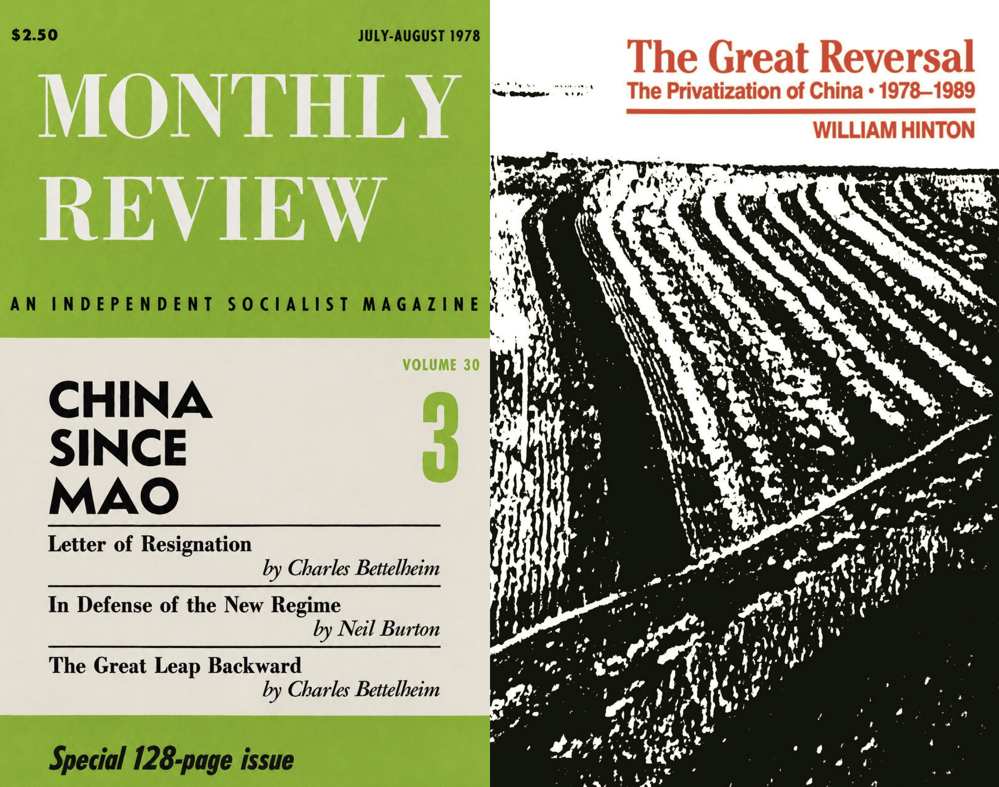

>我只能這樣説：不管革命失敗有多少次，但是我總希望中國的革命能成功，所以便不能不這樣奮鬥。
>
>——孙中山（1924）

>我是伟大的60年代的一个儿子，背负着它的感动与沉重，脚上心中刺满了荆棘。那个时代的败北，那个时代的意义，使我和远在地球各个角落的同志一样，要竭尽一生求索，找到一条自我批判与正义继承的道路。
>
>——张承志《心灵史》

>一位共和派的资产阶级数年前曾正确言道：“失败者没有历史。”那么，我们就来打破这种不公吧（..）。蒙蔽历史的时代已该终结。从今往后，在失败的幸存者中，总有人会直面刽子手和诽谤者，斥责他们：你们在撒谎！也会向心存善意的人们宣告：我们就是这样的人，我们做过什么，我们追求什么。正是出于这些考虑，这位**为伟大而暂时受挫的事业**而战的战士才提笔著述。他将尽力阐明1871年的公社是什么、做了什么、向往什么；但他同样要揭露那些不共戴天的敌人是什么、做过什么、又图谋什么。
>
>A republican bourgeois wrote rightly a few years ago:"The defeated have no history." Let us break, then, with this iniquity (..). The time to deceive history is over. From now on, among the survivors of the defeat, there will always be someone who says to the faces of the executioners and the slanderers: You have lied! And to tell men of good faith: This is what we are, what we have done and what we wanted. These are the considerations that made a soldier of this great, momentarily defeated cause take up his pen. He will try to say what the Commune of 1871 was, what it did and what it wanted; but he will also say what its implacable enemies are, what they did and what they want (Malon, 1871: 5-6 and 9).
>
>——Benoit Malon 《The Third Defeat of the French Proletariat（法兰西无产阶级的第三次败北）》 (1871)（第5—6页及第9页）

---

北京时间（东八区时间）1976年9月9日0时10分，毛泽东同志永远的停止了他个人的思想与实践之旅，距今已经正好整50年过去。当然，严格来说现在是2026年9月5日，还差那么不几天。

<figure>
  
  <figcaption style="font-size: 0.8em; text-align: center; color: #888;">图为1976年9月10日法国《解放报》（Libération）关于毛泽东逝世的特刊“Spécial Mao”头版——《东方红，太阳落》。风格极为鲜明。照片左侧以中文写了“东方红，太阳落”六个中文大字，法语“L'Orient est rouge, le soleil se couche.”则仅以一行小字标出。</figcaption>
</figure>

关于此，Michel Foucault曾经有一段非常有名的话。1977年他在接受一家德国学刊的访谈时，直接了当说道：

>现在或许可以说［伴随着毛泽东的逝世，以及“中国的热月反动”的发生——注］，自1917年俄国十月革命以来的60年，或者如果你愿意的话，可以说甚至自1848年欧洲各大革命运动以来的120年里，寰宇之内首次再也没有任何一个地方能让希望之光从中迸发。**方向已不复存在**。（……）
>
>面对中国刚刚发生的一切，整个左翼阵营——欧洲左翼的全部思想，那种曾几何时在世界各地都拥有其参照点、并以确定的方式对其加以阐发的欧洲革命思想，那种因而通过自身之外的事物来确定方向的思想，失去了它此前在世界其他地方所能找到的历史坐标。它失去了具体的**依凭**。而这是**历史首次**。
>
>peut-être, depuis la révolution russe d'octobre 1917, peut-être même depuis les grands mouvements révolutionnaires européens de 1848, c'est-à-dire depuis soixante ans ou, si vous voulez, depuis cent vingt ans, que c'est la première fois qu'il n'y a plus sur la terre un seul point d'où pourrait jaillir la lumière d'une espérance. Il n'existe plus d'orientation.（......）
>
>Pour la première fois, la gauche, face à ce qui vient de se passer en Chine, toute cette pensée de la gauche européenne, cette pensée européenne révolutionnaire qui avait ses points de référence dans le monde entier et les élaborait d'une manière déterminée, donc une pensée qui s'orientait sur des choses qui se situaient en dehors d'elles-mêmes, cette pensée a perdu les repères historiques qu'elle trouvait auparavant dans d'autres parties du monde. Elle a perdu ses points d'appui concrets.
>
>——*Michel Foucault, « La torture, c’est la raison »（1977），这篇访谈被收录在 《Dits et écrits（III）》中*

Michel Foucault 直接使用了“方向已不复存在”（Il n'existe plus d'orientation）这种表述。有趣的是，方向（orientation）一词在法语中可以部分的理解为某种双关语，因为该词内含“东方”（orient）——日出东方，以此明方向。既是“失向”，更是“失东”——仿佛二十世纪赖以自我理解的那套方向学（左与右、东与西、革命与秩序、启蒙与反启蒙）在“太阳落”那一刻突然崩溃。

但 Michel Foucault 并非悲观主义，恰恰相反，他本人紧接着就说自己是乐观主义者，并给出了他对这种境况的回应，而且这个回应对我来说恰恰很毛泽东，他说：

>“让我们重新开始吧”！重新开始一定是可能的。
>
>recommençons! Ce doit être possible de recommencer. 
>
>——*Michel Foucault, « La torture, c’est la raison »（1977）*

这句话顺理成章的让我想到一首很著名的毛泽东诗词：

>雄关漫道真如铁，而今迈步从头越。
>
>——*《忆秦娥·娄山关》*

***

有趣的是，恰恰是正因为如此，毛泽东的影响不止没有随着他的肉身死亡而停止，甚至可以说，它从1976年以后才真正进入了历史。

J.Moufawad-Paul就曾经主张，八十年代才是人们所称的毛派（别管是叫做毛泽东思想、毛泽东主义、Maoism还是Marxism-Leninism-Maoism、马列毛）真正形成的时期。他甚至挑衅性的（但恰恰基于历史考证的）提出：

在毛泽东活着的时候，并没有当下所谓的毛主义，那时全世界当然都有毛泽东的崇敬者，甚至已经有Maoist/Maoism这样的词汇，但这些词汇本身往往是论战性的且他称化的，无论是毛泽东本人，还是从欧洲、亚洲、非洲到美洲以毛泽东为榜样的崇敬者，他们普遍都并不觉得自己在实践的是一种明确的“Maoism”，相反，他们是“在追随毛泽东的脚步”实践“反修正主义的、反官僚主义、意图防止资本主义复辟的真正马克思主义”。

在毛泽东在世时，“追随毛泽东的脚步”是一种实践姿态，而非理论认同；它是一种正在进行时的、嵌入具体历史情境的政治行动，而非一种可供抽象的“主义”。

然而毛泽东去世后，情况却变的大不一样。

<figure>
  
  <figcaption style="font-size: 0.8em; text-align: center; color: #888;">
左侧：《China since Mao》（Vol. 30, No. 3: July-August 1978）
右侧：《The Great Reversal: The Privatization of China, 1978–1989》
</figcaption>
</figure>

上图左为1978年美国《Monthly Review》杂志专号《China since Mao》，整个专号就只在谈一件事：**毛泽东去世后的中国，正在经历一场其追随者们尚未完全理解的深刻断裂。** 

Charles Bettelheim 以冷峻的马克思主义政治经济学分析、敏锐的问题意识和观察能力，记录了从“继续革命”到“拨乱反正”的断裂性转向过程——那绝对不是简单的政策调整，而是整个国家机器与革命遗产之间的结构性脱钩。专号中 Bettelheim 的两篇文章，尤其是其第二篇《The Great Leap Backward》（中译为《大跃退》，这篇文章甚至部分可以说是结构了中国自己的早期毛派的关键文献之一）逐层拆解了一种完全不同的政治逻辑如何开始主导中国：生产力取代生产关系成为核心范畴，“四个现代化”悄然替换了“以阶级斗争为纲”，市场机制被重新引入社会主义经济体制。对于《每月评论》的读者——主要是社会主义者——来说，这份专号传递了的消息是如此的令人不安和沮丧。后来到1989年-1990年，因为众所周知的事情的触动，进步作家、农业专家 William Hinton 最终撰写了《The Great Reversal: The Privatization of China, 1978–1989》（上图右），可以说是对这种深刻断裂的认识的全面分析和最终总结。

可以说整个1980年代和1990年代，全世界左翼都在一种普遍的忧郁消化这种不安与晕眩。但这正是关键所在——当毛泽东去世、当中国自身的政治走向开始与毛泽东晚年的激进实验背道而驰时，毛派突然发现被迫面对一个认识论危机：

如果中国不再是“真正的社会主义”，背叛了“毛泽东的道路”，那么首先，“毛泽东的道路”究竟意味着什么？恰恰这种背景，反而是思想得以彻底产生的条件——只有当一种政治实践已经过去，它才第一次完整地成为一个理论问题。举个例子，当巴黎公社还在战斗的时候，整个第一国际充斥着的几乎都是战斗性但辩护性为主的文字。只有当巴黎公社失败以后，马克思才带着极大的悲痛，提笔写就了不朽的《法兰西内战》。

毛泽东活着的时候，“毛泽东思想”首先是一种正在进行的政治实践，而不是一种已经完成的思想体系。无论是继续革命、反官僚主义，还是对社会主义条件下阶级斗争的强调，本身都仍然嵌在一个真实存在的社会主义制度内部。它们面对的是“社会主义如何继续”的问题。

而1976年以后，问题彻底的变了。“中国的热月时刻”反而为毛泽东的思想本身划定了一个清楚的边界以及现成的认识对象，当中国的政治走向与毛泽东晚年的激进实验发生结构性断裂——当“继续革命”被“拨乱反正”所取代，当阶级斗争为纲被四个现代化所取代——“毛泽东的道路”才第一次成为一个完整的、可以被总体性审视和理论化的问题。失败赋予了它边界，而边界赋予了它形式。回不去的毛泽东时代本身也就此反而成为精神上永恒的故乡。

同时，那些具有左翼内核的思考必须开始面对和回答这样三个互相交错的新问题：

- **旧的社会主义为什么会失败？**
  
- **新的社会主义如何才能再起？**

- **新的社会主义要如何继承旧的社会主义的遗产，结清旧的社会主义的债务？**

而这才是决定了我们今天所看到的毛泽东思想追随者的问题，决定了他们在面对历史与当下的时候真实的问题域。

***

>那是**一七九三年的法国**，革命涌动的时代，到处是枪声、火焰与阴谋，里面说，**这些悲剧由巨人开始，而被侏儒结束**。我合上书，透过纱窗，抬眼望去是**一九九八年的铁西区**（……）
>
> ——*班宇《空中道路》（收录在短篇集《冬泳》中，上海三联［2018］）*

> **我们想创造一个新世界，但最终这个新世界崩溃了**。我拍的是一个主流人群的生活，他们和社会的关系，他们自己生命的印迹。如果把过去几十年的东西拿过来和我的片子放在一起看，你就会看到这几十年这个国家的人在做什么事情，就会看到那个时代人的理想是什么，最后他们的理想实现了没有。这是一个特别重要的问题，**同时也可以界定出以后我们应该怎么活**。
>
> ——*纪录片《铁西区》（1999）导演王兵*

话又说回来，这种重新理解，也并不只发生在毛派传统内部。更发生在中国这个无可避免的与共产主义革命之命运本身紧密相连的国家全体。事实上，整个世纪末的中国知识界，都在以不同的方式经历这一过程：一边，有人迫不及待的进行对毛泽东时代的反思、否定乃至告别（——徒劳的对幽灵进行拒斥甚至是“驱魔”），另一边吊诡的却是，恰恰是在毛泽东时代已经成为“过去”之后，人们才开始真正理解那个时代曾经在说什么。

比如，戴锦华在回忆过去的时候曾情绪复杂的说：

一种历史性的盲区（以及某种历史辩证）是，一开始对那些毛泽东心心念念的主张与话语（无论是“阶级斗争是纲，纲不举则目不张”、“千万不要忘记阶级斗争”、“革命无罪，造反有理”，还是“社会主义国家也有阶级斗争”）感到厌倦，恰恰是因为身处在那个 **不断尝试非阶级化（如果不说是“无阶级”的话）** 的社会里，恰恰因为它所描述的内容曾经被制度性的长时实践试图解决从而缩减。而当这种制度实践消失以后，在阶级重新出现以后， 一经大家再次被市场化置身于阶级分化的现实中，反而才真正第一次理解毛泽东（或者过去所存在过的社会主义）为什么曾经如此执着于阶级，惊愕的发现了那些话语到底有着怎样复杂但恰恰恳切的实际意义。

对那一代人来说，这件事非常令人伤感和失落，1976年-2002年的历史证明，一切至少对这代人已经太迟了：社会主义工厂体制、工人阶级作为一个具有完整社会身份和政治组织形式的主体相继土崩瓦解。市场最终成为宰制一切的霸权性现实。最终只留下了一片又一片徒余记忆的历史废墟、以及废墟之上各种各样的遗憾。

不过，对后代来说，倒是什么时候都不晚。

同样是戴锦华，2011年的时候，她曾经对张猛的电影（《钢的琴》，2010）大意这样评价：

对于2000年代来说，这注定是一部不合时宜的电影，因为被市场化侮辱与损害的人本身是不会有闲暇看这种电影的，而彼时有闲暇看这种电影的则恰恰是中国最反动的那群人——沉迷在新自由主义个人发财致富神话中的中大型城市中产阶级。所以，这是拍给被侮辱与损害的人们的继承者们看的。而对于继承者们来说，这种继承不可避免的是怀旧性（nostalgic）的 、忧郁化的，但恰恰却有生产性的可能。

戴锦华也在后面更加系统的评价《钢的琴》的文章《〈钢的琴〉——阶级，或因父之名》（《天下》杂志2012年第2期）最后部分以这一句话收尾：

>已逝之事，勾勒并召唤的也许正是未来之人。
